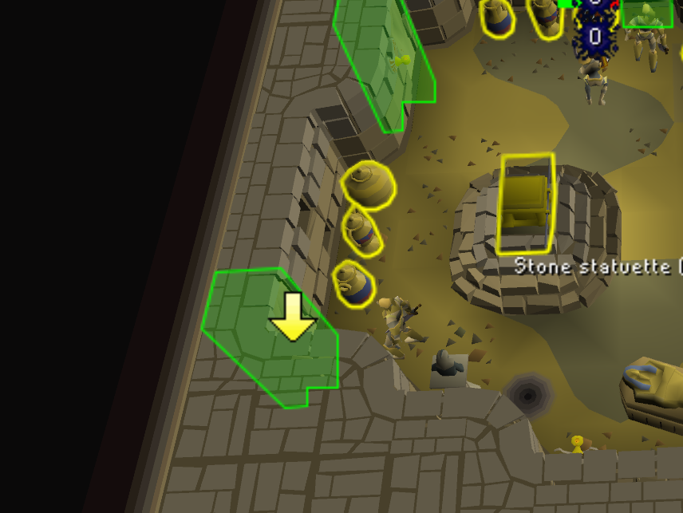

# Pyramid Plunder QoL

This plugin will track doors that are opened by other players and will show a hint arrow if the door was successfully opened. This helps when playing on the themed world (493).

The active door is reset when a new player enters the pyramid, but this method is not 100% accurate, as the first room is not always visible from the player's current location.

## Features

- Opened door tracking
- Hide Guardians (Mummy/Scarab swarm) from other players (or all/none)

